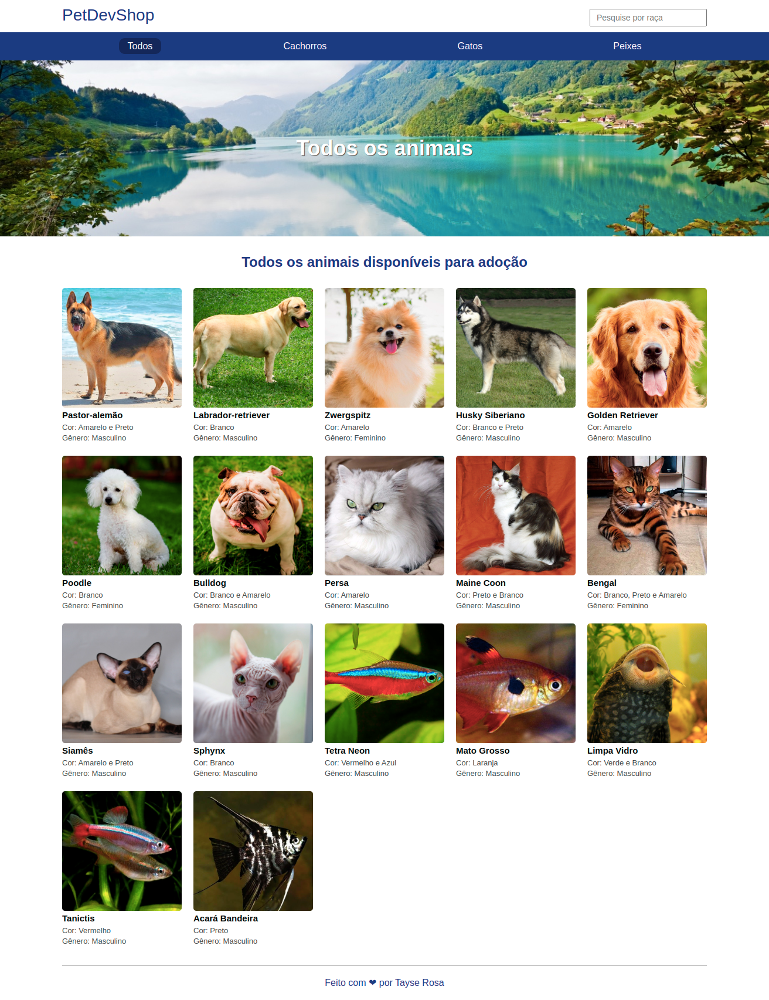

<p align="center">
  
</p>
<h1 align="center"> Projeto Dev Pet </h1>

<p align="center">Este projeto foi desenvolvido para praticar e consolidar os conhecimentos em Node.js, criando um site simples de Petshop, utilizando o NodeJS, com mustache e outras tecnologias  .</p>

<br>
🚀 Desenvolvedora:
<a href="https://www.tayserosa.com">
Tayse Rosa
</a>
<br>
🟢 Status do projeto: Concluído

---
<p align="center">
  
</p>


## 🚀 Tecnologias Utilizadas
<ul>
    <li>Node.js para a criação do servidor</li>
    <li>Nodemoon</li>
    <li>Typescript</li>
    <li>Mustache</li>
</ul>

## 🚀 Minhas anotações: Configuração inicial do projeto
<p>Para iniciar a configuração do projeto, fiz o seguinte passo abaixo:</p>

```
npm init
tsc --init
npm i express mustache-express dotenv
npm i -D @types/express @types/mustache-express @types/node 
sudo npm i -g nodemon typescript ts-node

```

## 🚀 Para você rodar o projeto
```
git clone https://github.com/TayseRosa/dev-pet.git
cd <nome da pasta do projeto>
npm install
npm run start-dev
```


## Licença
Esse projeto está sob a licença MIT. Veja o arquivo [LICENSE](LICENSE.md) para mais detalhes.


## 📫 Contribuindo para Projeto

Para contribuir com Projeto, siga estas etapas:

1. Bifurque este repositório.
2. Crie um branch: `git checkout -b <nome_branch>`.
3. Faça suas alterações e confirme-as: `git commit -m '<mensagem_commit>'`
4. Envie para o branch original: `git push origin <nome_do_projeto> / <local>`
5. Crie a solicitação de pull.

Como alternativa, consulte a documentação do GitHub em [como criar uma solicitação pull](https://help.github.com/en/github/collaborating-with-issues-and-pull-requests/creating-a-pull-request).


<a href="https://www.tayserosa.com">
<p align="center">Feito com 💜 por Tayse Rosa</p>
</a>